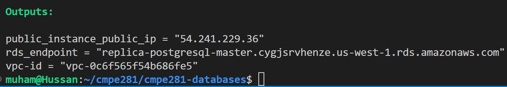
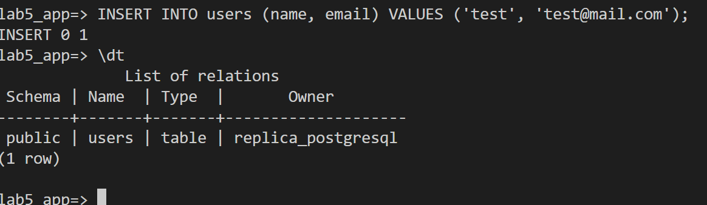
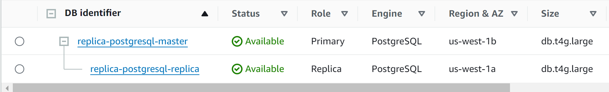
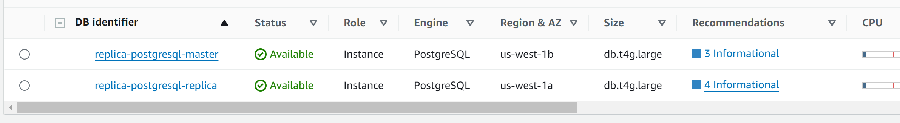

[](https://classroom.github.com/a/Tzud8eS3)
# CMPE281 | Databases - RDS, Redshift, NoSQL

In this lab, we will explore a three tier architecture. The three tiers are the presentation layer (or the static web server), the data layer (or the ExpressJS backend server) and the storage layer (or the User Postgres Database hosted on RDS).


## Task 1: Deploy the Three Tier Application from Terraform

Because there are many components we've already seen, I've written the Terraform code for the following resources.

- VPC
  - Three subnets:
    - public subnet for frontend server
    - private subnet for backend server
    - private subnet for database server
  - Internet Gateway
  - NAT Gateway
- EC2 Instances
  - SSH key
  - Frontend server
    - user data script to setup frontend
    - is placed in VPC public subnet
  - Backend server
    - user data script to setup backend
    - is placed in VPC private subnet
- Security Groups
  - Frontend Security Group
    - allow SSH 
    - allow HTTP
    - allow egress all
  - Backend Security Group
    - allow SSH from frontend
    - allow HTTP on port 8080
    - allow egress all
  - Database Security Group
    - allow access to database from backend
  
Your task will be to use this AWS RDS module to create and connect the application to the database.

Reference: [Terraform RDS doc](https://registry.terraform.io/modules/terraform-aws-modules/rds/aws/latest)

The following values must be used:

```
  engine                = "postgres"
  port                  = 5432
  db_name  = "replicaPostgresql"
  username = "replica_postgresql"
  password = "UberSecretPassword"
```
Take a screenshot of your succesfully created database, e.g.,


## Task 2: Connect to Your Database and Create the User Table

Connect to your private backend instance the same way you connected to the private instance in the last lab and see if you can access the database using the following command, with your values instead.
```
psql -h <DB_ENDPOINT> -p 5432 -U replica_postgresql replicaPostgresql
```

Once you've connected to the database, run the following commands sequentially to create the table for the app.
```
> CREATE DATABASE user_database;
> \c user_database
> CREATE TABLE users (id SERIAL PRIMARY KEY, name VARCHAR(100), email VARCHAR(100) UNIQUE);
> \dt
> INSERT INTO users (name, email) VALUES ('your name', 'your email');
```

Take a screenshot of the output, it should resemble this:


## Task 3: Update the Backend App with the Values of Your Database 

The backend app requires the URL to the database and its credentials. 

SSH into the backend server and create a `.env` file in the `~/api` directory. Add the following variables with your values
```
DATABASE_URL=postgres://replica_postgresql:UberSecretPassword@<DB_ENDPOINT_URL>:5432/user_database
HOST=http://localhost
PORT=8080
```

Start the app by running 
```
npm install && npm start
```

If the networking has been successful, we should be able to add a user by running cURL:
```
curl -X POST http://<API_IP_ADDRESS>:8080/api/users \
-H "Content-Type: application/json" \
-d '{"name": "your user", "email": "your email"}'
```

Then, fetch the database entries using
```
curl http://<API_IP_ADDRESS>:8080/api/users
```

Take a screenshot of the successful cURL commands from the public instance.

## Task 4: Add a Replica to Your Database

Add a read replica to your database using Terraform. If you haven't already, you will need to enable back ups.

Take a screenshot in the AWS Console of your read replica. It should look like this:


## Task 5: Promote your database to primary

In a disaster recovery scenario, your primary database might go down. In the console, promote your read-replica to primary.

Take a screenshot of your promoted read-replica, e.g.,


# Deliverables

## Self Study

Read the following links to learn more about modules and input variables:

- [Database Selection Considerations](https://docs.aws.amazon.com/pdfs/decision-guides/latest/databases-on-aws-how-to-choose/databases-on-aws-how-to-choose.pdf?did=wp_card&trk=wp_card#databases-on-aws-how-to-choose)
- [Multi-tier Serverless](https://d1.awsstatic.com/whitepapers/AWS_Serverless_Multi-Tier_Architectures.pdf?did=wp_card&trk=wp_card)

## Knowledge Check (2 pts)

1. The architecture of this three tier app is very brittle, what can be done to increase the resiliency of the data and the elasticity of the application without switching to a serverless design?
2. In the self study we explored multi-tiered serverless architecture. In what situations is it advisable to use serverless architecturre versus traditional customer managed architecture?

## Lab Files

Your final repository should include the following Terraform files and the PDF file containing all screenshots and knowledge check answers. The PDF file should also be uploaded and submitted to the Canvas assignment for this lab.

- `vpc.tf`
- `ec2.tf`
- `sg.tf`
- `rds.tf`
- `lab-rds.pdf`
  - Screenshots
    - (Task 1) screenshot of created database
    - (Task 2) screenshot of inserted user and user table
    - (Task 3) screenshot of successful cURL commands from public instance
    - (Task 4) screenshot of added read replica
    - (Task 5) screenshot of read replica promoted to primary
  - Answers to knowledge check questions
