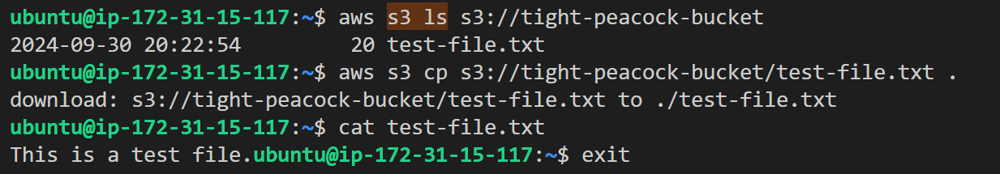
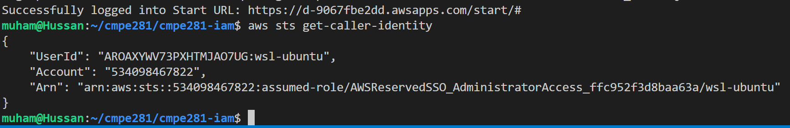

# CMPE281 | IAM - Policies, RBAC, Authentication
In this lab, we will explore IAM users, groups, roles, policies, and how roles can be assigned to services such as EC2 or be assumed by other accounts. For this assignment, you will require a partner. Furthermore, we will also discuss ChatGPT and its usage in engineering.

## ChatGPT Discussion

As AI progresses, it is likely that AI companions will become a standard that raises the bar for engineering productivity, much like how the Internet and search engines deprecated the use of textbooks for coding. Keep in mind, using ChatGPT is a double edged sword, and there are some pros and cons to consider before using it.

**Pros**:

- Does the menial work of finding and tweaking boilerplate code to meet your needs.
- Can summarize many pages of details into simple and concise paragraphs.
- Keeps your research and thought process all in a single place.

**Cons**:

- Takes away from your opportunity to learn more about the intricacies of a subject.
- Code can be outdated or even incorrect.
- Code you use from ChatGPT will be much harder to maintain as you don't really understand it as well as code you write yourself.
- You need to thoroughly understand your problem statement to construct a query which will allow ChatGPT to give you what you need. Not understanding your problem statement may lead you to waste time down the wrong path.
- Verbosity is unintuitive at times. 

ChatGPT is a powerful tool. I expect the world to adopt some form of AI assistance in all roles at a rapid rate, starting especially with the software industry. However, what separates efficient engineers from code monkeys is the ability to dig deep into the docs when the need arises. Reading documentation is actually its own skill, which is why I've had so many tasks require you to read different articles/tutorials. It's better that you walk away from this Master's Program with a polished ability to study and learn from documentation rather than the ability to deliver solutions generated by ChatGPT. I doubt such a skill will be employable in the near future as that takes little skill and such tasks will probably be automated anyway. What remains for you to offer is creativity, ingenuity, and the ability to do what machines quite literally cannot -- that is think outside of the box.

## Task 1: Assign a Role to an EC2 Instance to Access an S3 Bucket (2 pts)

Your objective is to create an S3 bucket and a file in it, an EC2 instance you can shell into, and an IAM role that will be attached to the EC2 instance to allow it to access the bucket. Use ChatGPT to generate three files:
1. `ec2.tf` - This will hold all resources related to the EC2 instance and shelling into it.
2. `s3.tf` - This will hold all resources related to the S3 bucket and the file in it.
3. `iam.tf` - This will hold all resources related to the IAM role used to access the bucket.

Additional specifications.
- Your bucket name should use the data block to include your account number in it.
- Your file name should be your first name and last name, e.g., `Muhammed_Mahmood.txt`.
- Your file's contents should include the name of you and your partner(s), e.g., `"My name is Muhammed, my partner(s) are Shahrukh Khan, and Aamir Khan."`
- The terraform output must include
  - your EC2 instance's private IP address; and
  - your bucket name.
  
When you've created the resources, shell into the instance, and install the AWS CLI. Ask ChatGPT if you don't remember how from the beginning of class. Then, use `aws s3 ls <your_bucket_url>` to list the contents of your bucket and `aws s3 cp <your_bucket_url>/<your_file_name> .` to copy the file from the bucket.

If your setup was succesful, your output should look like this. 

Take a screenshot of your output for the lab.

## Task 2: Allow Your partner's IAM Role to Access Your S3 Bucket (3 pts)

For this task, you will need to work with your partner(s) to allow their IAM roles created in task 1 to access your S3 bucket.

Reference: [Access policies doc](https://docs.aws.amazon.com/IAM/latest/UserGuide/access_policies-cross-account-resource-access.html)

Take a screenshot of:
- Listing the contents of your partner(s) buckets from your EC2 instance
- Copying the files from your partner(s) buckets to your EC2 instance
- Reading the files from your instance using `cat Partner's_Filename.txt`

This can all be contained in a single screenshot. Note that the IP address of your private instance must match the IP address outputted earlier in the lab.

## Task 3: Revisiting SSO (2 pts)

In the beginning of the semester, we covered setting up SSO. This was an ambitious task for the start of the semester, however as we've progressed, so to has our familiarity with AWS. Let's now use this time to go back to the AWS docs and set up sso. 

Reference: [Steps to configure SSO for aws cli](https://docs.aws.amazon.com/cli/latest/userguide/cli-configure-sso.html#cli-configure-sso-configure)

If you've already done this, feel free to submit a screenshot of your terminal logging into SSO and running `aws sts get-caller-identity`. Your output must show the role you are assuming. Note that this will require you to revoke your configuration for your access key and secret key. 

Feel free to switch back to using access keys and secret keys after this is done.

Take a screenshot like so:

# Deliverables

## Self Study

Read [this article](https://leebriggs.co.uk/blog/2022/09/05/authenticating-to-aws-the-right-way) on the different methods of authentications

Also look into [AWS Cognito](https://docs.aws.amazon.com/cognito/latest/developerguide/what-is-amazon-cognito.html) and its usecases as it is sometimes used in enterprise.

## Knowledge Check (3 pts)

1. Did you run into any errors while working with ChatGPT? What were they and how did they impact your performance on this lab?
2. What was your biggest takeaways from the two articles you read?
3. What's the difference between AWS Cognito User Pools and Identity Pools?

## Lab Files

Your final repository should include the following Terraform files and the PDF file containing all screenshots and knowledge check answers. The PDF file should also be uploaded and submitted to the Canvas assignment for this lab.

- `ec2.tf`
- `s3.tf`
- `iam.tf`
- `lab-iam.pdf`
  - Screenshots
    - (Task 1) screenshot of terraform output with bucket name, EC2 private IP address
    - (Task 2) screenshot of EC2 instance listing contents of your bucket and file
    - (Task 3) screenshot of EC2 instance listing contents of your partner(s)' buckets and files
    - (Task 4) screenshot of your terminal logging into SSO and output of `aws sts get-caller-identity` showing a role.
  - Answers to knowledge check questions