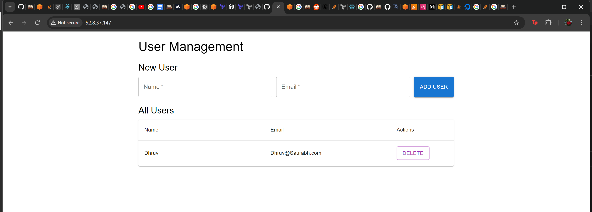
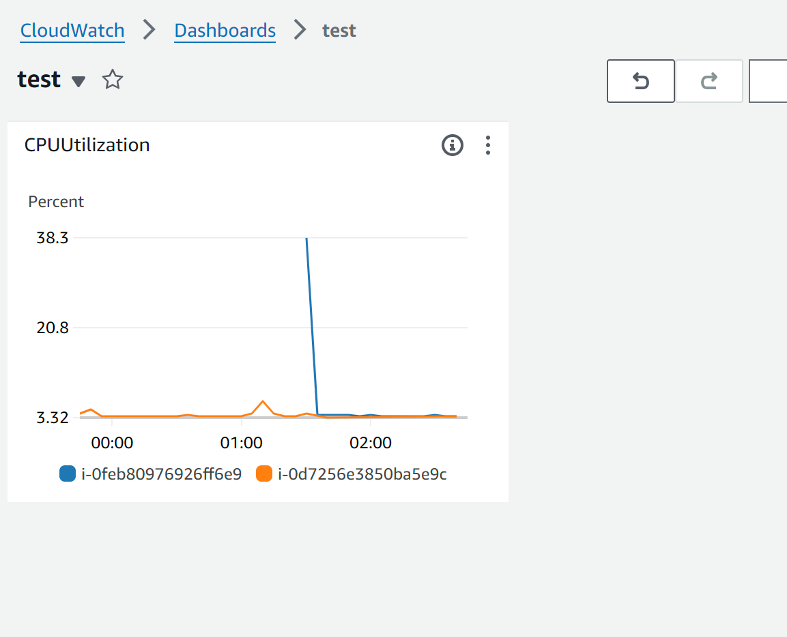
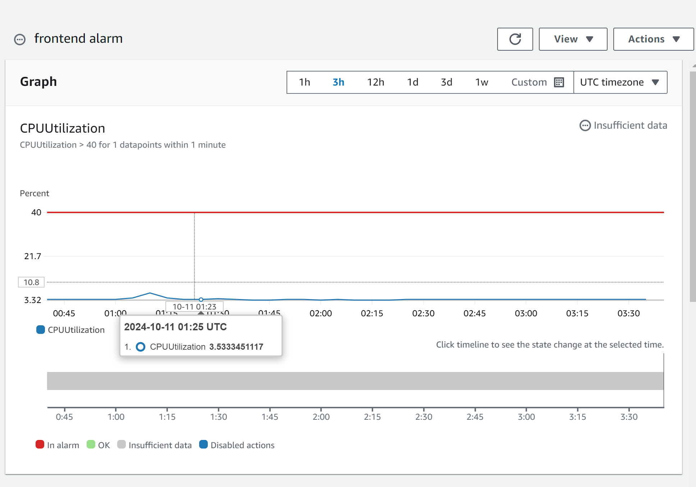
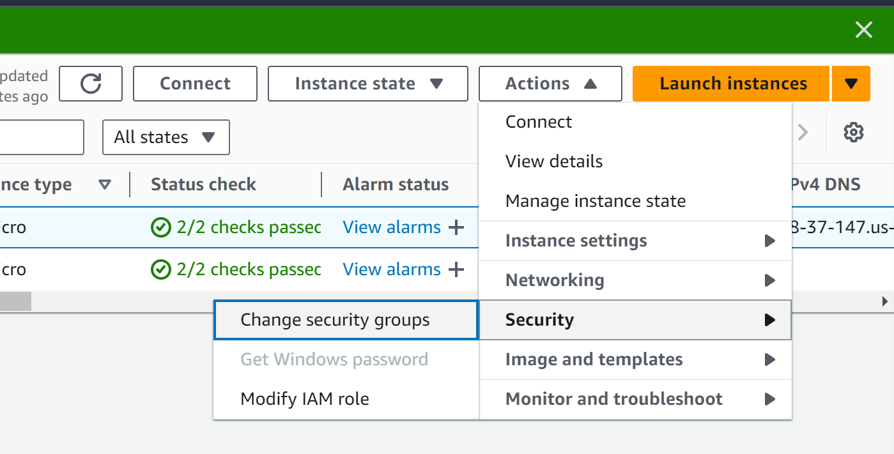
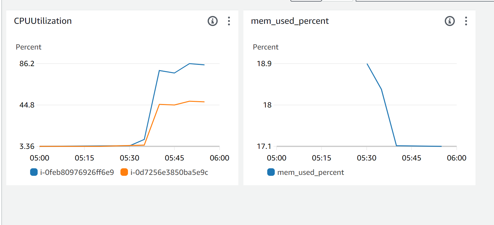
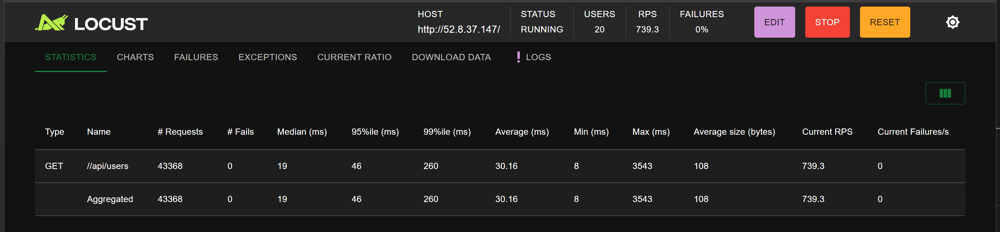
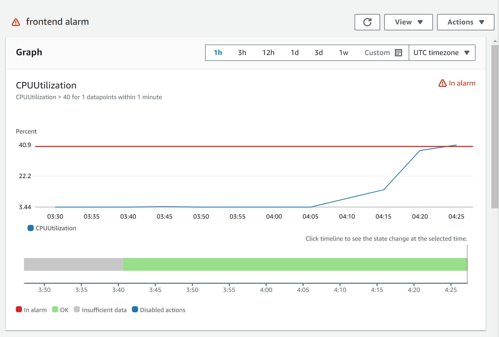
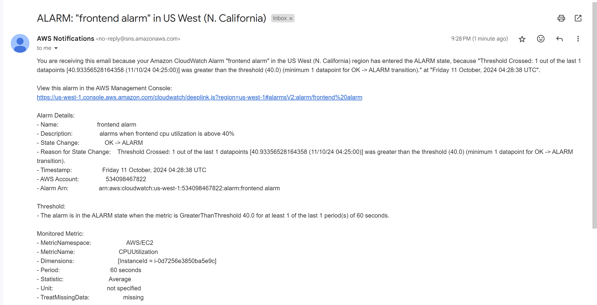

[](https://classroom.github.com/a/crZhkyG3)
# CMPE281 | Monitoring - CloudTrail, CloudWatch, Config

In this lab we will pretend we're cloud engineers for ACME. ACME wants to pilot a very lightweight service with a three tier architecture. Your lab contains the code for this service with the following:

1. A frontend service running on a single front end server
2. A backend service running on a single backend server
3. A single primary database instance

Your boss has instructed you to deploy this service and load test it to see if it can handle what your production servers are seeing. You must also set up monitoring to keep track of the CPU and memory utilization and send notifications when the metrics get too high.

The provided Terraform code should deploy everything successfully and you should be able to see in your browser a web page to handle traffic to the database. While the code is expected to work, should you run into any hiccups setting it up, consider it part of the job. 

## Task 1: Deploy the Three Tier App (1 pt)

Deploy the three tier app and navigate to your IP address. If you wait a few minutes, you should see a page that can add and delete users from a table. Add a user and take a screenshot.



## Task 2: Integrate with Cloudwatch (1 pt)

Use Cloudwatch to create a dashboard which keeps track of the CPU and memory metrics of the frontend and backend instance.



Add an alarm when the CPU reaches critical levels. Keep the number around 40% as we're going to try load testing the service and triggering the alarm.



## Task 3: Setup Cloudwatch Agent (4 pts)

This is going to be a long task and one I don't want to provide a lot of guidance for, so consider this the meat of the assignment.

I will break this down into a handful of steps.

1. Install the CloudWatch agent on your instance. You'll need `wget` the right package for x86-64 Ubuntu as that's what the instances in the lab are using. Install with `sudo dpkg -i -E ./amazon-cloudwatch-agent.deb`. You may refer to this [installation doc. ](https://docs.aws.amazon.com/AmazonCloudWatch/latest/monitoring/install-CloudWatch-Agent-commandline-fleet.html)
2. Set up an IAM role to be used by the instance to send metrics to CloudWatch. See this link to [setting up IAM roles.](https://docs.aws.amazon.com/AmazonCloudWatch/latest/monitoring/create-iam-roles-for-cloudwatch-agent-commandline.html)
3. Attach the role to the instance. You can do this in the console by navigating to the EC2 instance tab and selecting it in the actions dropdown. 
4. Setup the configuration file for CloudWatch Agent. You can refer to [this doc](https://docs.aws.amazon.com/AmazonCloudWatch/latest/monitoring/create-cloudwatch-agent-configuration-file-wizard.html).
5. Restart your service, and ensure it works. You can find the [troubleshoot doc here](https://docs.aws.amazon.com/AmazonCloudWatch/latest/monitoring/troubleshooting-CloudWatch-Agent.html).

Complete this task by creating a new metric in your dashboard which shows memory utilization. 




## Task 4: Install and Run Load test (3 pt)

Install Locust using

```
pip3 install locust
```

Then Locust in the `loadtest` directory.

You can configure the parameters of the load test in the browser and run it. After a few minutes, you should see your CPU utilization spike.

Take a screenshot of your running locust test and the spike in your CPU utilization, and the resulting alarm.

### Sample screenshots
**Running loadtest**



**Spike in CPU utilization**


**Alarm threshold crossed**


**Alarm notification sent to email**



## Knowledge Check (1 pt)

Q: Did your memory spike? Why could it be possible that the CPU spiked heavily but the memory did not? 

# Deliverables

You do not need to commit anything to the repository. Only upload and submit to the Canvas assignment the PDF file named `lab-monitoring.pdf` that contains the following items:
- Screenshot of running webserver (Task 1)
- Screenshot of CPU metric widget in dashboard (Task 2)
- Screenshot of CPU utilization alarm (Task 2)
- Screenshot of memory usage widget in dashboard (Task 3)
- Screenshot of load test running locally in browser (Task 4)
- Screenshot of CPU spike (Task 4)
- Screenshot of alarm threshold crossed (Task 4)
- Screenshot of alert in your email (Task 4)
- Answers to knowledge check questions
