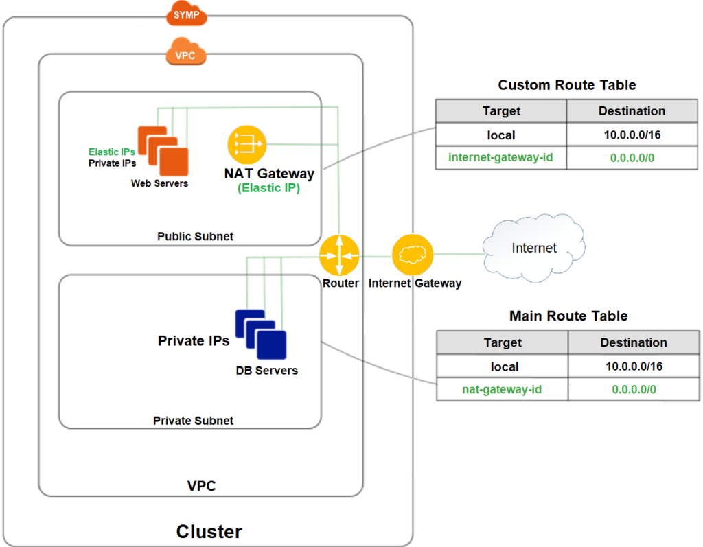
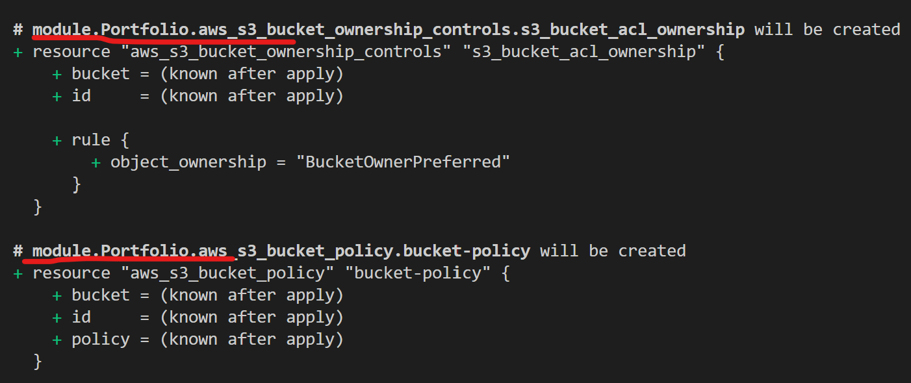
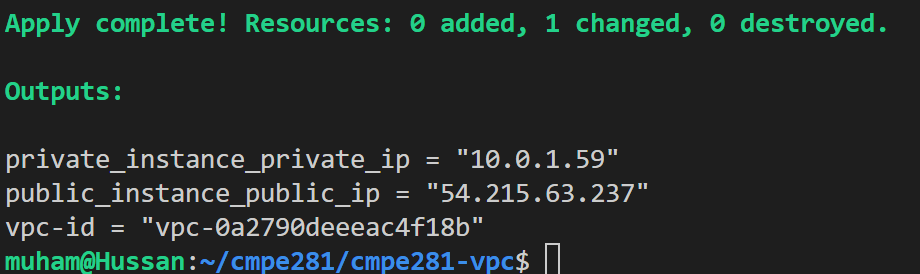
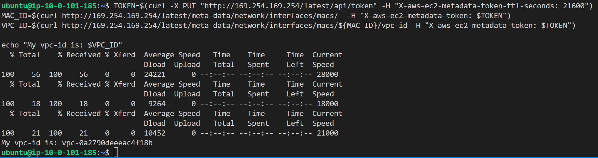
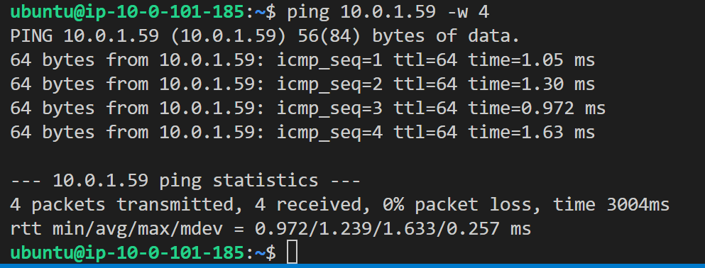
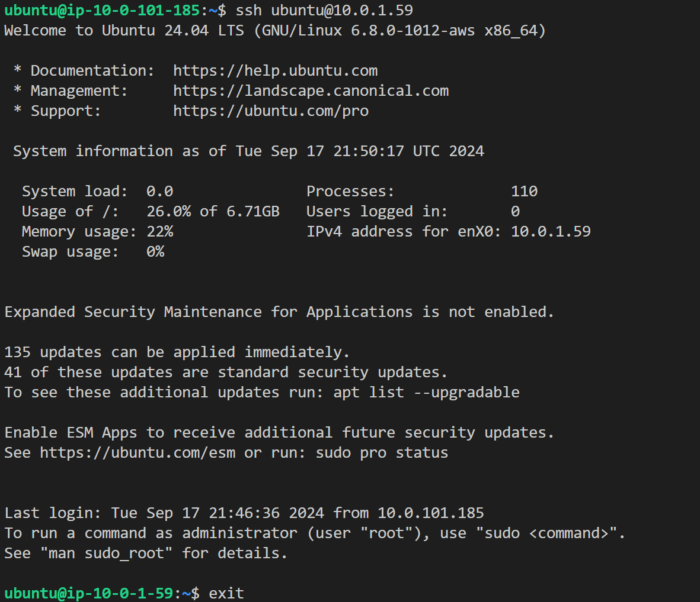
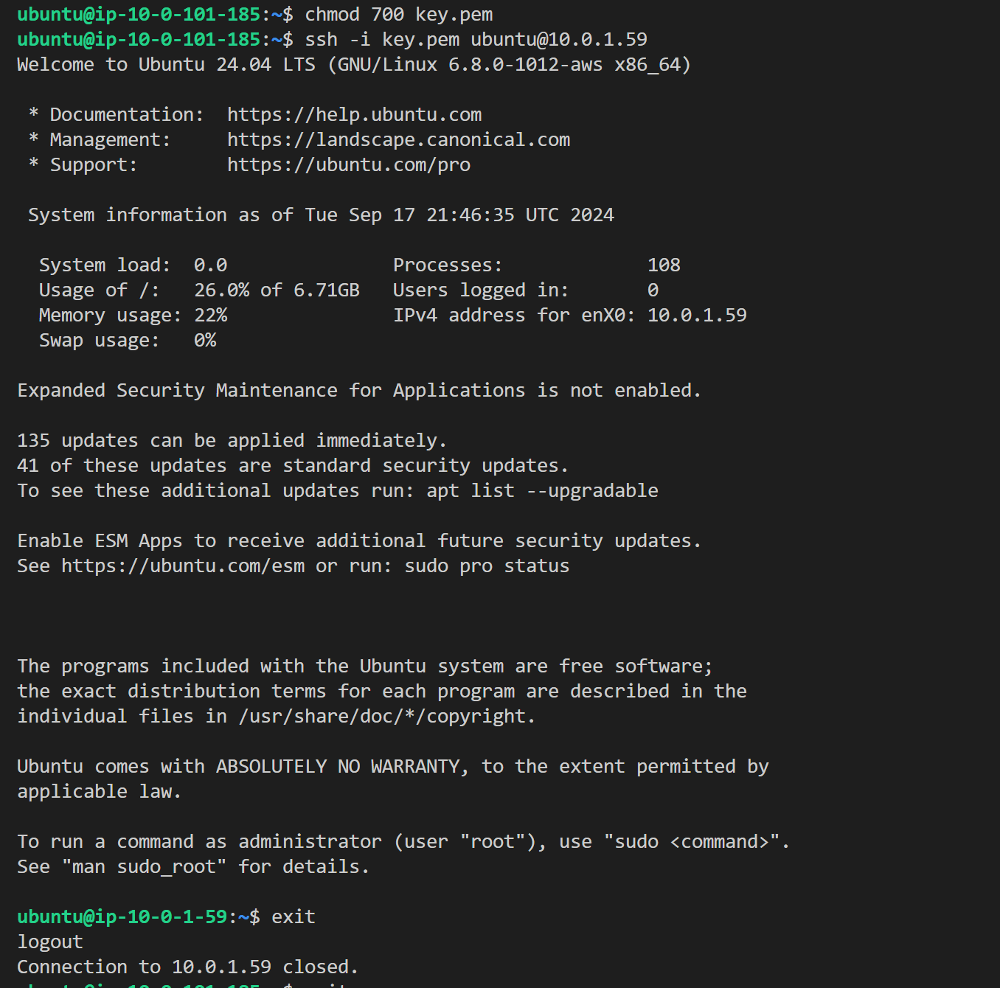
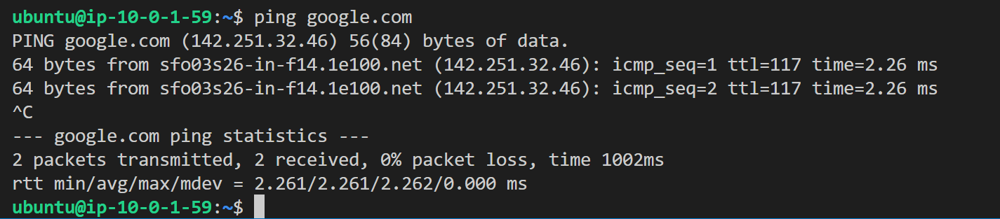

[](https://classroom.github.com/a/Q2lFjDnG)
# CMPE281 | VPC - Basic Networking and Routing

In today's lab, we will create the following infrastructure: 
+ VPC 
  + Public Subnets 
  + Private Subnets
  + Internet Gateways 
  + Route Tables 
  + NACLs
  + EC2 instances within those subnets
  + NAT Gateway



Reference: [AWS — Difference between Security Groups and Network Access Control List (NACL)](https://medium.com/awesome-cloud/aws-difference-between-security-groups-and-network-acls-adc632ea29ae)

We will also use Terraform modules to learn how complex infrastructure with multiple resources can be coupled into a single reuseable definition.

## Task 1: Working with Modules (1 pt)

What are modules? Simply put, a module is a collection of Terraform files. Each lab we've created could be referenced to as a module. Modules can be used to take a complex definition of multiple interconnected resources and simplify them into a single object block. For example, Lab: Storage can be reused by defining the module block.

```
module "Portfolio" {
    source = "./cmpe281-storage"
}
```

This will create all Terraform resources in the `cmpe281-storage` directory.

Try putting this in a Terraform file outside of your `cmpe281-storage` directory and run `terraform init`/`terraform plan`. 

Take a screenshot of your output which now refers to the resources using a `module.module_name` prefix, e.g., 


## Task 2: Create a VPC from a Remote VPC Module (1 pt)

Now that we've got an idea how modules work, let's move on to something more complex.

Reference: [VPC Module doc](https://registry.terraform.io/modules/terraform-aws-modules/vpc/aws/latest)

In the document above, we can see that this module allows us to create many different kinds of resources.

We will use this module to create:
+ A VPC
  + Public Subnets
  + Private Subnets
  + An Internet Gateway
  + A NAT Gateway
  + Route Tables

Run `terraform plan` in the lab repo and see all the resources being created by the VPC module.

Take a screenshot of the VPC ID in the output of the `terraform apply`, e.g.,

## Task 3: Create a Public Bastion We Can Shell Into (2 pts)

In this task, we will create an instance in the public subnet. This instance will be used to communicate with instances in a private subnet. Such instances are typically referred to as bastion hosts, or just bastions. 

1. Start by creating an instance in the public subnet, this will require you to specify the subnet id in the `aws_instance` resource.
2. Utilize the code from lab 1 to create a security group for the instance which allows SSH; and the code to create/associate SSH keys to shell into the instance. Note that there is no need to allow traffic to HTTP. Just SSH is fine.
3. Replace `security_groups` with `vpc_security_group_ids`, this will make your terraform run cleaner.
4. You will notice that a public ip address is missing, this is because AWS notices we're using a different VPC and automatically restricts connectivity to our instance. We can fix this by attaching an Elastic Ip Address. Look up how to create and associate an Elastic IP with an instance without using an ENI.
5. Once you've defined the EIP, add an output block which will print out the IP address of our EIP.  
6. Once you've gained SSH access, run the script below in the terminal to show that the VPC ID the instance matches the VPC ID of the Terraform output.

```
TOKEN=$(curl -X PUT "http://169.254.169.254/latest/api/token" -H "X-aws-ec2-metadata-token-ttl-seconds: 21600")
MAC_ID=$(curl http://169.254.169.254/latest/meta-data/network/interfaces/macs/  -H "X-aws-ec2-metadata-token: $TOKEN")
VPC_ID=$(curl http://169.254.169.254/latest/meta-data/network/interfaces/macs/${MAC_ID}/vpc-id -H "X-aws-ec2-metadata-token: $TOKEN") 

echo "My vpc-id is: $VPC_ID"
```
Take a screenshot of the output of this script, e.g.,


## Task 4: Create an Instance in the Private Subnet (2 pts)

Now, let's spin up a private instance and see if we can communicate with it using ping.

1. Create an instance in the private subnet passing in the private subnet ID the same way we did for the bastion host.
2. Attach a security group which allows ICMP on all ports (Hint: use -1 for to and from in the security group rule to allow all ICMP traffic).
3. Add an output block in Terraform which prints the private IP of the instance to the terminal.
4. SSH into the bastion host and run `ping PRIVATE_IP -w 4` (replace `PRIVATE_IP` with the private IP address of your instance).

Take a screenshot of the ping successfully hitting the private IP address, e.g.,


## Task 5: Shell Into the Private Instance (2 pts)

Now that we can confirm we've set up the correct security group rules to allow ICMP connectivity, let's connect to the instance using SSH agent forwarding.

1. Add a security group to the private instance to allow SSH access from the bastion host.
2. Using Terraform, associate the key pair we created for the bastion host with the private instance. This should recreate the instance.
3. Now, we need to add the SSH key to our agent.
   ```
   ssh-add /path/to/your-private-key.pem
   ````
5. We also need to set up our SSH config, it should look like this.  
      ``` 
      # Configuration for the Bastion Host
      Host bastion
      HostName PUBLIC_EIP
      User ubuntu
      IdentityFile /path/to/your/key.pem
      ForwardAgent yes

      # Configuration for the Private Instance
      Host private-instance
      HostName PRIVATE_IP
      User ubuntu
      ProxyJump bastion
      ```
6. Now we can SSH into the bastion with SSH forwarding enabled using:
   ```
   ssh -A ubuntu@PUBLIC_EIP
   ```
8. If everything was set up correctly, we should be able to directly shell into the private instance by running,
   ```
   ssh ubuntu@PRIVATE_IP
   ```

Take a screenshot of your successful ssh forward into the private instance, e.g.,  


If you are struggling with SSH forwarding. You can shell into the private instance by copying the contents of `key.pem` and pasting it into a `key.pem` file on the bastion host, then use that to connect to the private instance. Your screenshot would look like this:


Test that the private instance can access the Internet through the NAT gateway by pinging google.com. Then take a screenshot like so:


# Deliverables

## Self Study

Read the following links to learn more about modules and input variables:

- [A Quick Overview of Modules and Variables in Terraform](https://medium.com/swlh/a-quick-overview-of-modules-and-variables-in-terraform-f094984a8437)
- [Input Variables - Hashicorp Terraform Docs](https://developer.hashicorp.com/terraform/language/values/variables)
- [VPC Use Cases](https://subscription.packtpub.com/book/security/9781789134513/1/ch01lvl1sec08/vpc-use-cases) - Also look into the different use cases of VPCs and why they are widely used in the industry

## Knowledge Check (2 pts)

1. One of the pain points of this lab was copying over old code from Lab: Compute and modifying some hard coded values to adjust it to our needs. Use what you learned from the self study articles and today's lab to propose a cleaner way to create the EC2 instances and security groups. 
2. The VPC module automatically creates route tables for the subnets. What is the destination for the route to external traffic in the route table associated with the private subnet?

## Lab Files

Your final repository should include the following Terraform files and the PDF file containing all screenshots and knowledge check answers. The PDF file should also be uploaded and submitted to the Canvas assignment for this lab.

- `vpc.tf`
- `ec2.tf`
- `sg.tf`
- `lab-vpc.pdf`
  - Screenshots
    - (Task 1) screenshot of Terraform output which refers to the Lab: Storage resources using a `module.module_name` prefix
    - (Task 2) screenshot of the VPC ID in Terraform outputs
    - (Task 3) screenshot of the script outputting VPC ID
    - (Task 4) screenshot of the ping successfully hitting the private IP address
    - (Task 5) screenshot of the successful SSH into private instance and screenshot of ping hitting google.com
  - Answers to knowledge check questions
